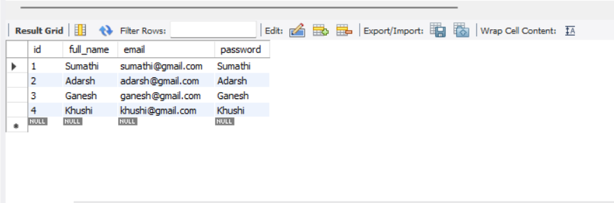

## Overview
The Pet Store Web Application is a comprehensive platform designed to provide users with a seamless experience for purchasing pet products online. The application features a user-friendly interface with sections for Home, Login, Registration, Cart, and Order management.

## Features

- **Home**:  
  The homepage showcases the latest pet products and categories.

- **Login**:  
  Registered users can log in to their accounts to access personalized features, including order history and saved carts.

- **Register**:  
  New users can create an account by providing their details, enabling them to shop, place orders, and check out.

- **Cart**:  
  Users can add products to their cart, view selected items, update quantities, and proceed to checkout.

- **Order**:  
  The order section allows users to review their orders, view order history, and also cancel orders.

## Technologies Used

- **Frontend**:  
  HTML, CSS, JavaScript, Bootstrap 4.0

- **Backend**:  
  Java, Servlets, JDBC

- **Database**:  
  MySQL

- **Server**:  
  Apache Tomcat

## Screenshots

### Home

### Register

### Login

### Cart

### Orders

## Database Schemas

### Register Database

### Products Database

### Orders Database

